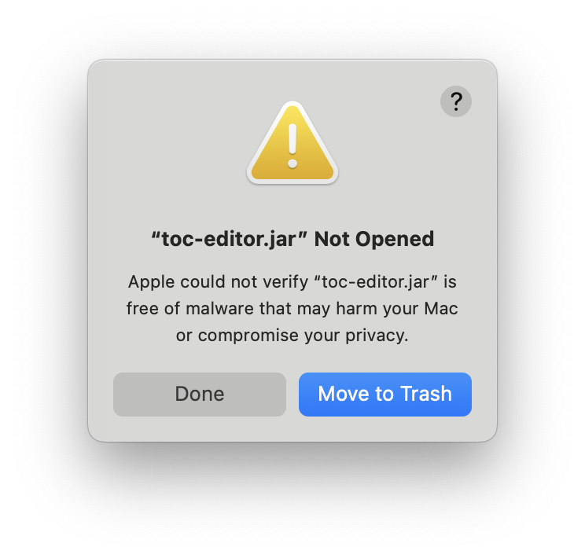
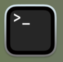
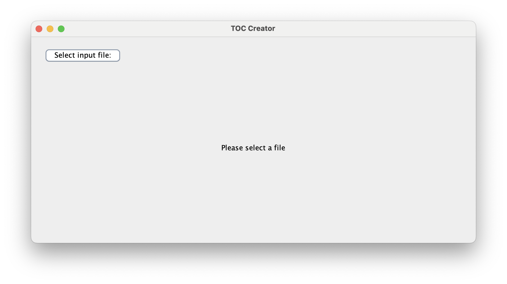

# PDF's Table of Content editor

Do you have PDFs whose Table of Content (or Outlines) that you want to edit? If so, this is the right software for you.

# Download

Click [here](./executable/toc-editor.jar) to download the software. Then, once downloaded, run it by double clicking.

**If you can't run the software**, you probably don't have Java Runetime Environment. [Click here to download one](https://www.azul.com/downloads/?version=java-24&package=jre#zulu).

**If you are on MacOS**, you might see something like this:



In order to fix this, open Terminal.



Go to the `Downloads` folder with the following command:

```
cd ~/Downloads
```

Then, run the following command:

```
xattr -c ./toc-editor.jar
```

Now, try to open toc-editor.jar again. It should succeed now.

# How to use?

1. When you first open the application, you will see this screen:



2. Click on **Select input file** to open the PDF of which you want to edit the table of contents.

  

3. Once you have selected a PDF, you will be shown the current table of contents of the pdf.


4. You have 4 ways of changing the table of contents:
   1. Add Child

      Just select the item to which you want to add an inner entry, and press **Add Child** at the top right.

      

      

   2. Edit
      Just select the item you want to edit and press **Edit** button at the top right.

      

      

   3. Remove

      Just select the item you want to remove and press **Remove** button at the top right.

      

   4. Rearranging

      Just drag and drop the entry to your destination.

      

5. After you are done, don't forget to press **Save As** button. You will be asked to select the output folder and output file name.
